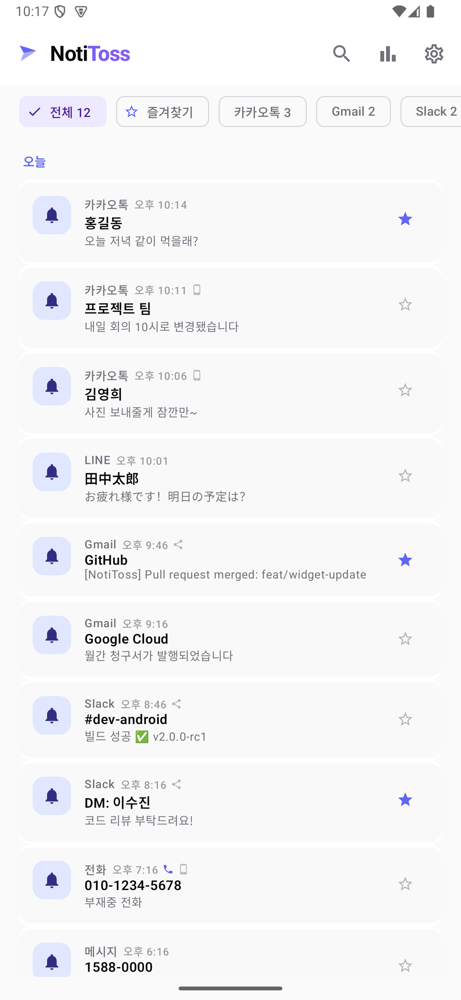
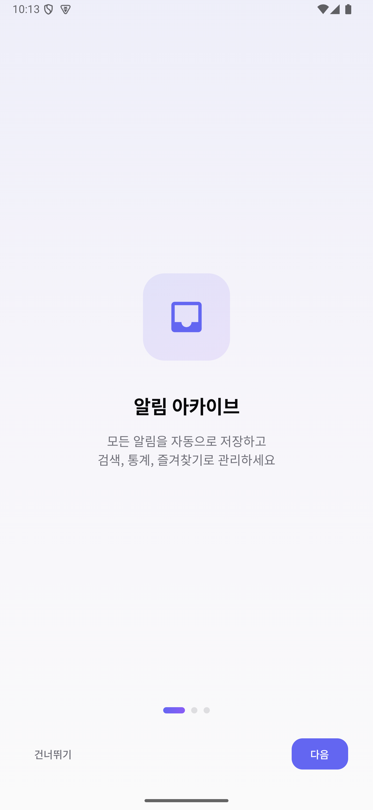
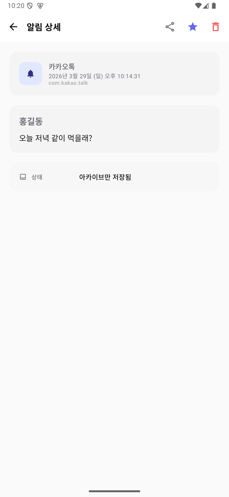
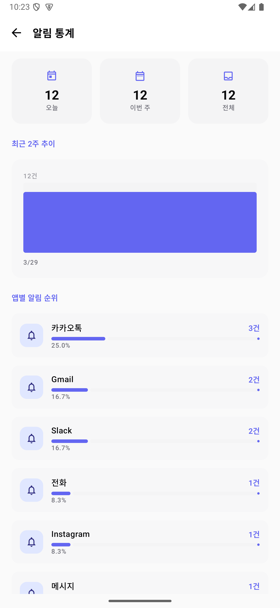
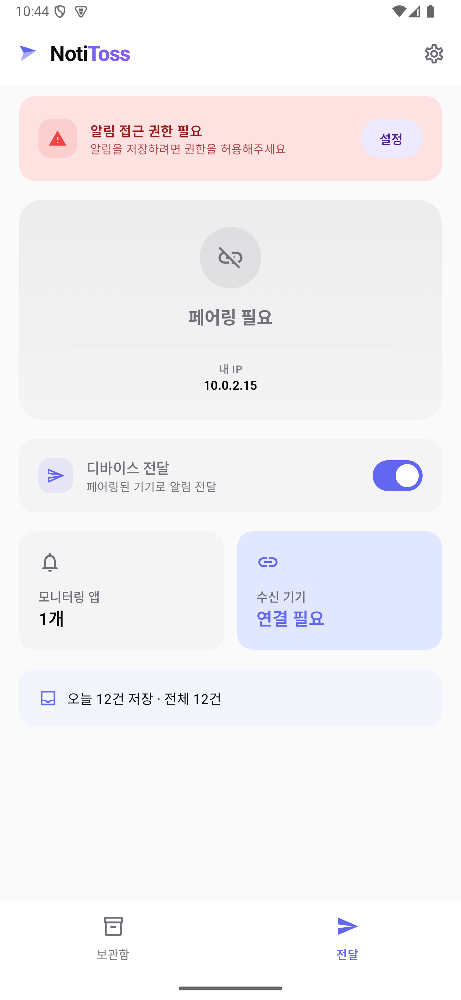
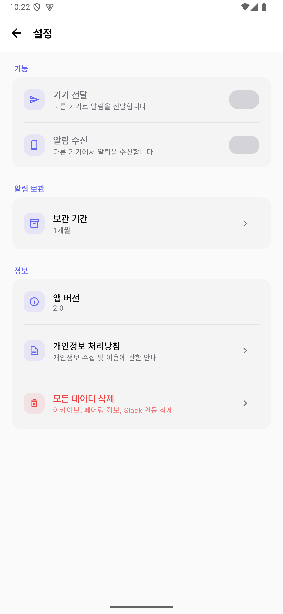

# NotiToss

> 안드로이드 기기 간 알림을 로컬 네트워크로 실시간 전달하고, 모든 알림을 자동 보관합니다.

<p align="center">
  
</p>

---

## 소개

**NotiToss**는 같은 Wi-Fi 네트워크 내에서 안드로이드 기기 간 알림을 전달하는 앱입니다.

클라우드 서버 없이 기기 간 직접 통신하므로 빠르고 안전합니다.
메인폰의 알림을 태블릿, 서브폰 등 여러 기기로 미러링하고,
수신한 모든 알림을 자동으로 보관하여 검색, 통계, 즐겨찾기로 관리할 수 있습니다.

---

## 스크린샷

<p align="center">
  
  
  
  
</p>
<p align="center">
  
  
</p>

---

## 주요 기능

### 알림 보관함
- 수신한 모든 알림을 자동 저장 (Room DB)
- 앱별 필터, 전체 텍스트 검색 (FTS4)
- 즐겨찾기, 다중 선택 삭제
- 보관 기간 설정 (자동 정리)

### 알림 통계
- 일별 알림 수 추이 차트
- 앱별 알림 순위 및 비율

### 알림 미러링
- 1:N 멀티 디바이스 — 송신 기기 1대에서 수신 기기 여러 대로 동시 전달
- 앱별 선택 전달 — 원하는 앱의 알림만 골라서 전달
- 아이콘 전달 — 알림 아이콘과 앱 아이콘을 함께 전달
- 전화 알림 — 수신 시 헤드업 알림 + 진동, 통화 종료 시 자동 해제

### 페어링
- 6자리 코드로 간편하고 안전한 페어링
- 기기별 개별 관리, 연결 상태 실시간 확인
- 양방향 해제 지원

### 기타
- 보관함 위젯 — 최근 알림을 홈 화면에서 바로 확인
- 전달 상태 위젯 — 기기 전달/수신 상태 및 연결 기기 표시
- 방해금지 무시 — 전화 알림은 DND 모드에서도 전달
- 부팅 후 자동 재시작 — 서비스 및 Worker 자동 복구
- Slack 연동 — 알림을 Slack 채널로도 전달

---

## 동작 방식

```
┌──────────────┐        Wi-Fi (HTTP)        ┌──────────────┐
│   송신 기기    │  ───────────────────────▶  │   수신 기기    │
│  (메인폰)     │                            │ (태블릿/서브폰) │
│              │   알림 감지 → 즉시 전달       │              │
│  Notification │                            │  알림 표시 +   │
│   Listener   │                            │  보관함 저장   │
└──────────────┘                            └──────────────┘
```

- 클라우드 서버 없이 **로컬 네트워크 직접 통신** (HTTP, 포트 8080)
- **EncryptedSharedPreferences**로 토큰 암호화 저장
- 알림 아이콘은 WEBP 압축으로 전송하여 배터리/네트워크 절약

---

## 기술 스택

| 분류 | 기술 |
|------|------|
| Language | Kotlin |
| UI | Jetpack Compose + Material 3 |
| Database | Room (FTS4 전문 검색) |
| HTTP Server | NanoHTTPD |
| HTTP Client | OkHttp |
| Background | WorkManager + Foreground Service |
| Widget | Glance AppWidget |
| Security | EncryptedSharedPreferences (AES256-GCM) |
| Navigation | Compose Navigation |
| Notification | NotificationListenerService |

---

## 프로젝트 구조

```
app/src/main/java/com/smithcat/noti_toss/
├── data/                  # 데이터 계층
│   ├── db/                # Room Database, Entity, DAO, FTS
│   ├── NotificationRepository.kt
│   └── PreferenceManager.kt
├── model/                 # 도메인 모델
├── network/               # HTTP 클라이언트/서버, TLS, Slack
├── service/               # NotificationListener, Receiver, Worker
├── ui/
│   ├── component/         # 공용 UI 컴포넌트
│   ├── navigation/        # Bottom Nav + 라우팅
│   ├── screen/            # UI 화면 (13개)
│   └── theme/             # 디자인 시스템
├── util/                  # 네트워크 유틸
└── widget/                # Glance 위젯 (보관함, 전달 상태)
```

---

## 요구 사항

- Android 9.0 (API 28) 이상
- 알림 미러링 시: 두 기기가 같은 Wi-Fi 네트워크에 연결

---

## 사용 방법

### 알림 보관 (기본)
1. NotiToss 설치 후 온보딩 완료
2. 알림 접근 권한 허용
3. 모든 알림이 자동으로 보관함에 저장됩니다

### 알림 전달 (송신 기기)
1. 설정 → "기기 전달" 토글 ON
2. 전달 탭 → 모니터링 앱 선택
3. 수신 기기 추가 (IP + 6자리 코드)

### 알림 수신 (수신 기기)
1. 설정 → "알림 수신" 토글 ON
2. "페어링 시작" → 6자리 코드 표시
3. 송신 기기에서 코드 입력하면 연결 완료

---

## 라이선스

All rights reserved.
